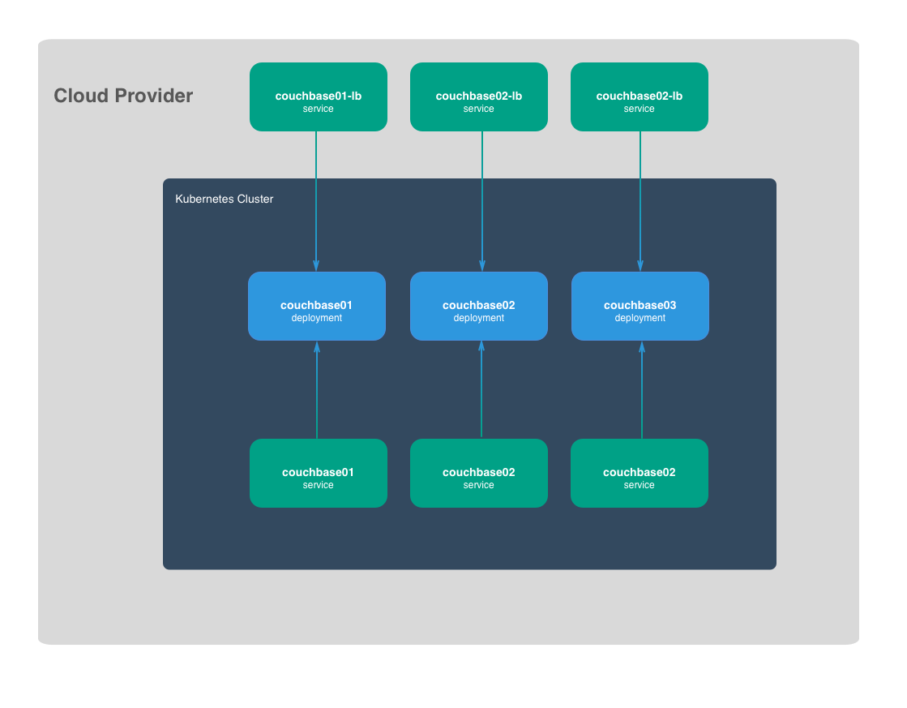

# Couchbase on Kubernetes

The Couchbase on Kubernetes tutorial documents how to deploy [Couchbase](https://www.couchbase.com/) on [Kubernetes](https://kubernetes.io/). The following diagram provides a high level overview of the Couchbase on Kubernetes architecture.



The following components will be deployed to a Kubernetes cluster with minimal CPU and memory allocations to control cost:

* [Couchbase](https://www.couchbase.com/) community-4.5.1

## Features

The following features exist with this infrastructure:

* [X] Use of official Couchbase Docker Image
* [X] Clusterized Couchbase of 3 instances
* [X] Automatic Self-healing of failing Pods
* [X] Automatic Self-healing of failing Nodes
* [X] Couchbase connectivity from outside of the Kubernetes
* [ ] No automatic Clustering: Clustering process is done manually at first startup.
* [ ] No automatic Scaling: Scaling of new instances needs generation of new deployments and services.

## Rationale

Couchbase can be installed either directly on the OS, or using Docker containers to prepare the cluster. There are existing solutions of clustering Couchbase using Docker containers, but they lack some of the features that containers can bring such as self-healing in case of pod or node failure.

This tutorial is designed so that the entire flow of clustering can be seen as step-by-step process.

The architecture is a static cluster of 3 instances of Couchbase, using the official docker image of Couchbase. The cluster is also designed so that it can be accessed by a service that resides outside of the Kubernetes cluster.

> It is designed as a tutorial guideline, not for production usage.

Kubernetes can ease the deployment and management of Couchbase by leveraging some of Kubernetes advanced features including:

* [Advanced Scheduling: Affinity and Anti-affinity](https://kubernetes.io/docs/concepts/configuration/assign-pod-node/)

In this tutorial we haven't used support for Stateful Applications or Dynamic Storage Provision, that could enable automatic Scaling:

* [Support for Stateful Applications](https://kubernetes.io/docs/concepts/workloads/controllers/statefulset/)
* [Dynamic Storage Provisioning](https://kubernetes.io/docs/concepts/storage/persistent-volumes/#dynamic)

## Tutorial

* [Prerequisites](docs/01-prerequisites.md)
* [Install Client Tools](docs/02-client-tools.md)
* [Provision The Kubernetes Infrastructure](docs/03-kubernetes-infrastructure.md)
* [Provision The Couchbase Infrastructure](docs/04-couchbase-infrastructure.md)

### Clean up

Run the `clean-up` bash script to remove all compute resources created by this tutorial:

```shell
bash clean-up
```

### Credits

A big shout-out to Kelsey Hightower, this tutorial is inspired by the [nomad-on-kubernetes](https://github.com/kelseyhightower/nomad-on-kubernetes) repo.
